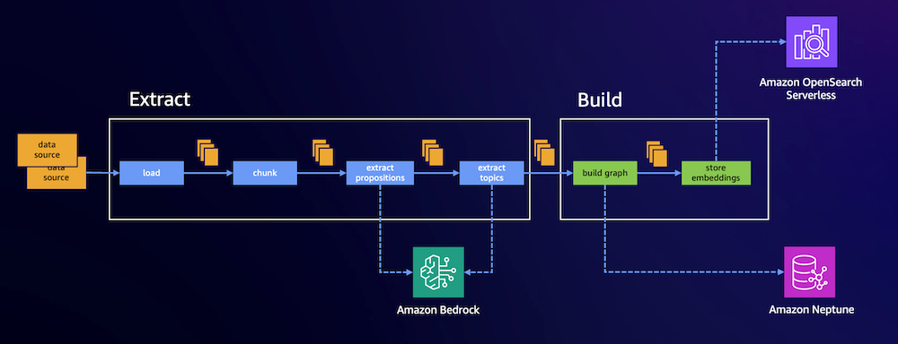
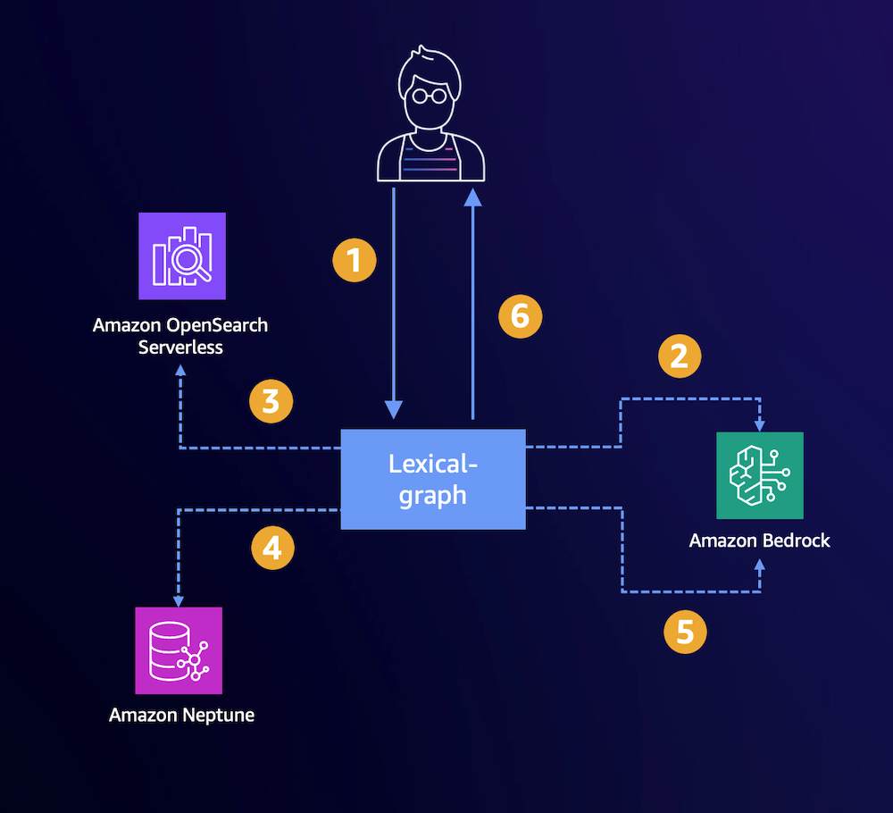

[[Home](./)]

## Overview

The graphrag-toolkit [lexical-graph](../../lexical-graph/) library provides a framework for automating the construction of a [hierarchical lexical graph](graph-model.md) (a graph representing textual elements at several levels of granularity extracted from source documents) from unstructured data, and composing question-answering strategies that query this graph when answering user questions.

### Stores and model providers

The lexical-graph library depends on three backend systems: a [_graph store_](./storage-model.md#graph-store), a [_vector store_](./storage-model.md#vector-store), and a _foundation model provider_. The graph store allows an application to store and query a lexical graph that has been extracted from unstuctured, text-based sources. The vector store contains one or more indexes with emebddings for some of the elements in the lexical graph. These embeddings are primarily used to find starting points in the graph when the library runs a graph query. The foundation model provider hosts the Large Language Models (LLMs) and embedding models used to extract and embed information.

The library has built-in graph store support for [Amazon Neptune Analytics](https://docs.aws.amazon.com/neptune-analytics/latest/userguide/what-is-neptune-analytics.html) and [Amazon Neptune Database](https://docs.aws.amazon.com/neptune/latest/userguide/intro.html), and built-in vector store support for Neptune Analytics, [Amazon OpenSearch Serverless](https://docs.aws.amazon.com/opensearch-service/latest/developerguide/serverless.html) and Postgres with the pgvector extension. It is configured to use Amazon Bedrock as its foundation model provider. Besides these defaults, the library can be extended to support other third-party backends.

### Indexing and querying

The lexical-graph library implements two high-level processes: [_indexing_](./indexing.md) and [_querying_](./querying.md). The indexing process ingests and extracts information from unstuctured, text-based source documents and then builds a graph and accompanying vector indexes. The query process retrieves content from the graph and vector indexes, and then supplies this content as context to an LLM to answer a user question.

#### Indexing

The indexing process is further split into two pipeline stages: [_extract_](./indexing.md#extract) and [_build_](./indexing.md#build). The extract stage ingests data from unstructured sources, chunks the content, and then uses an LLM to extract sets of topics, statements, facts and entities from these chunks. The build stage uses the results of the extract stage to populate a graph and create and index embeddings for some of the content. 

Extraction uses two LLM calls per chunk. The first 'cleans up' the content by extracting sets of well-formed, self-contained propositions from the chunked text. The second call then extracts topics, statements, facts, and entities and their relations from these propositions. Proposition extraction is optional: the second LLM call can be perfomed against the raw content, but the quality of the extraction tends to improve if the proposition extraction is performed first.

The overall indexing process uses a micro-batching approach to progress data through the extract and build pipelines. This allows the host application to persist extracted information emitted by the extract pipeline, either to the filesystem or to Amazon S3, and/or inspect the contents, and if necessary filter and transform the extracted elements prior to consuming them in the build pipeline. Indexing can be run in a continuous-ingest fashion, or as separate extract and build steps. Both modes allow you to take advantage of Amazon Bedrock's batch inference capabilities to perform [batch extraction](./batch-extraction.md) over collections of documents.

The following diagram shows a high-level view of the indexing process:

#### Querying

Querying is a two-step process consisting of _retrieval_ and _generation_. Retrieval queries the graph and vector stores to fetch content relevant to answering a user question. Generation then supplies this content as context to an LLM to generate a response. The lexical-graph query engine allows an application to apply the retrieve operation by itself, which simply returns the search results fetched from the graph, or run an end-to-end query, which retrieves search results and then generates a response. 

The lexical-graph contains two different retrievers: a [semantic-guided](./querying.md#semanticguidedretriever) strategy, which is optimized for precise, detailed queries requiring fine-grained evidence, and a [traversal-based](./querying.md#traversalbasedretriever) strategy, which is optimized for retrieving broader, thematically related information distributed across multiple documents.

The following diagram shows a high-level view of the end-to-end query process:

Query steps:

  1. The application submits a user question the lexical graph query engine.
  2. The engine generates an embedding for the user question.
  3. This embedding is used to perform a topK vector similarity search against embedded content in the vector store.
  4. The results of the similarity search are used to anchor one or more graph queries that retrieve relevant content from the graph.
  5. The engine supplies this retrieved content togther with the user question to an LLM, which generates a response.
  6. The query engine returns this response to the application.

### Multi tenancy

The lexical-graph library's [multi-tenancy](./multi-tenancy.md) feature allows an application to host multiple separate lexical graphs in the same underlying graph and vector stores. Tenant graphs may correspond to different domains, collections of documents, or individual users.

### Security

Implementers using the lexical-graph library are responsible for securing access to the data sources they wish to index, and for provisioning and securing the underlying AWS resources, such as Neptune and OpenSearch, used by the library. The documentation includes [guidance](./security.md) on using AWS Identity and Access Management (IAM) policies to control access to Amazon Neptune, Amazon OpenSearch Serverless, and Amazon Bedrock.

Irrespective of the policies applied to the identity under which the a lexical-graph application runs, the library always Sigv4 signs requests to AWS resources. Connections always use TLS version 1.3.

### Getting started

You can get up-and-running with a fresh AWS environment using one of the [quickstart AWS CloudFormation templates](../../examples/lexical-graph/cloudformation-templates/) supplied with the repository. Each of the quickstart templates creates an Amazon SageMaker-hosted Jupyter notebook containing several [example notebooks](../../examples/lexical-graph/notebooks/) that show you how to use the library to index and query content.

The resources deployed by the CloudFormation templates incur costs in your account. Remember to delete the stack when you've finished with it so that you don't incur any unnecessary charges.

Choose from the following templates:

 - [`graphrag-toolkit-neptune-db-opensearch-serverless.json`](../../examples/lexical-graph/cloudformation-templates/graphrag-toolkit-neptune-db-opensearch-serverless.json) creates the following lexical-graph environment:
   - Amazon VPC with three private subnets, one public subnet, and an internet gateway
   - Amazon Neptune Database cluster with a single Neptune serverless instance
   - Amazon OpenSearch Serverless collection with a public endpoint
   - Amazon SageMaker notebook with sample code
 - [`graphrag-toolkit-neptune-db-aurora-postgres.json`](../../examples/lexical-graph/cloudformation-templates/graphrag-toolkit-neptune-db-aurora-postgres.json) creates the following lexical-graph environment:
   - Amazon VPC with three private subnets, one public subnet, and an internet gateway
   - Amazon Neptune Database cluster with a single Neptune serverless instance
   - Amazon Aurora Postgres Database cluster with a single serverless instance
   - Amazon SageMaker notebook with sample code

